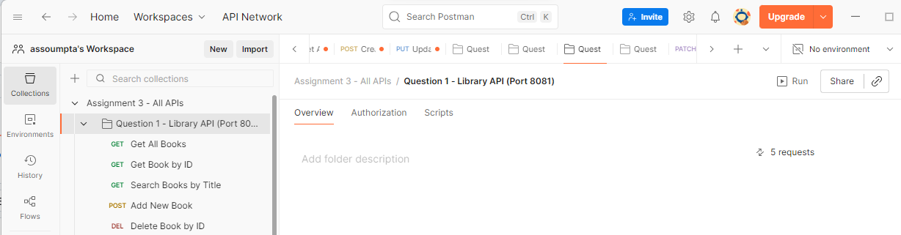
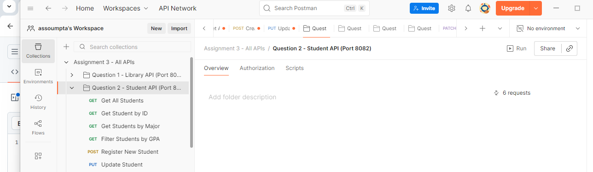
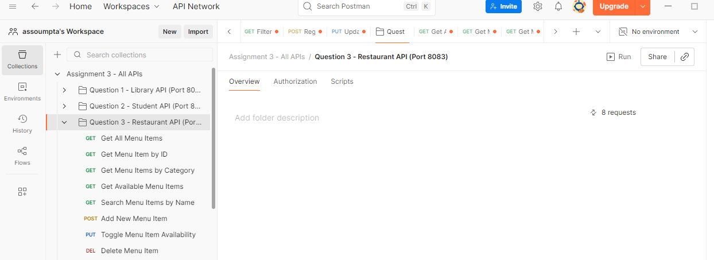
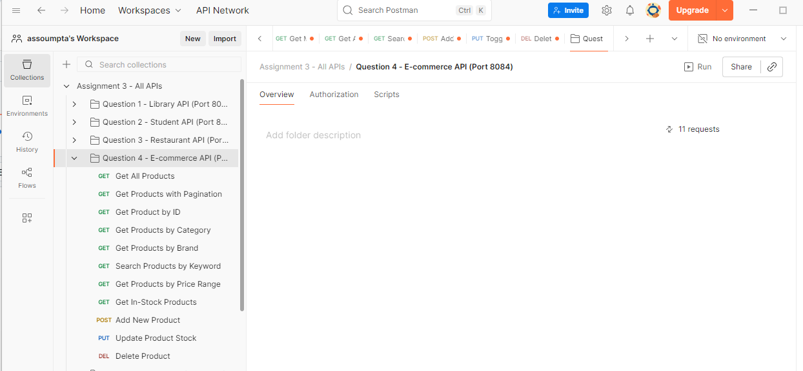
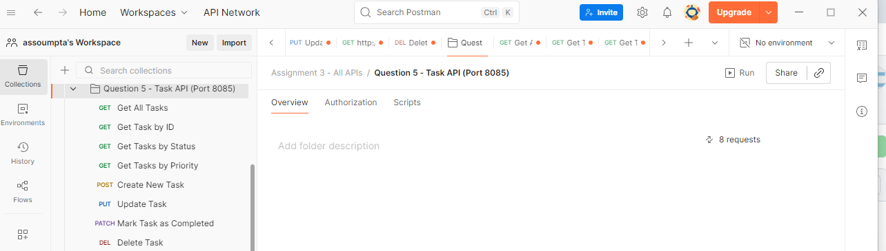
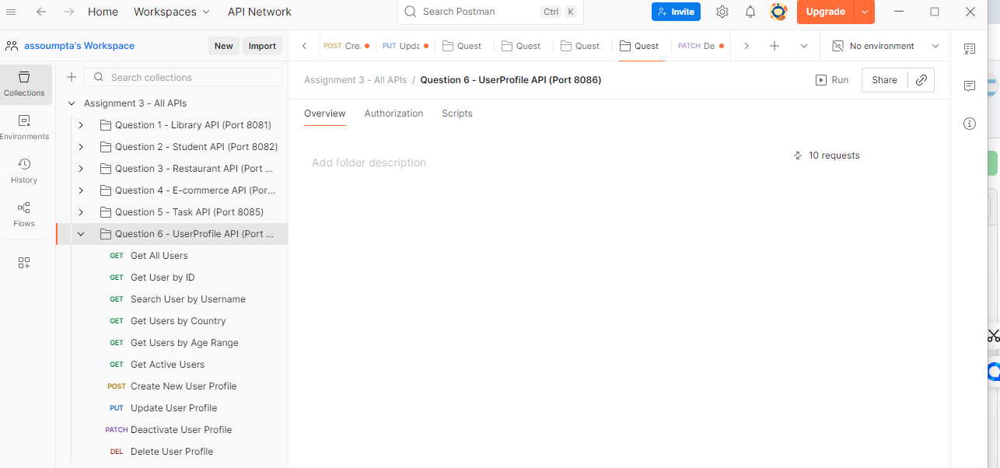

# 🚀 Web Technology Assignment - REST API Collection

A comprehensive collection of 6 Spring Boot REST APIs demonstrating CRUD operations, filtering, pagination, and advanced API design patterns.

---

## 📋 Table of Contents
- [Projects Overview](#projects-overview)
- [Technologies Used](#technologies-used)
- [Getting Started](#getting-started)
- [API Documentation](#api-documentation)
- [Testing](#testing)
- [Author](#author)

---

## 🎯 Projects Overview

| # | Project Name | Description | Port | Collection |
|---|-------------|-------------|------|------------|
| 1 | **Library Management API** | Manage books with search functionality | `8081` | [Download](Question1_Library_API.postman_collection.json) |
| 2 | **Student Management API** | Student records with GPA filtering | `8090` | [Download](Question2_Student_API.postman_collection.json) |
| 3 | **Restaurant Menu API** | Menu items with availability tracking | `8082` | [Download](Question3_Restaurant_API.postman_collection.json) |
| 4 | **E-Commerce Product API** | Products with stock & price management | `8086` | [Download](Question4_ECommerce_API.postman_collection.json) |
| 5 | **Task Management API** | Tasks with priority & completion status | `8087` | [Download](Question5_Task_Management_API.postman_collection.json) |
| 6 | **User Profile API** | User profiles with activation control | `8089` | [Download](Question6_User_Profile_API.postman_collection.json) |

---

## 🛠️ Technologies Used

- **Java 25**
- **Spring Boot 4.0.2**
- **Spring Web**
- **Maven 3.6.9**
- **RESTful API Design**
- **Postman** (for testing)

---

## 🚦 Getting Started

### Prerequisites
```bash
Java 17 or higher
Maven 3.6+
Postman (optional, for testing)
```

### Installation & Running

1. **Clone the repository**
```bash
cd "web tech assignment"
```

2. **Navigate to any project**
```bash
cd question1_library_api/question1_library_api
```

3. **Run the application**
```bash
mvn spring-boot:run
```

4. **Access the API**
```
http://localhost:{PORT}/api/{endpoint}
```

---

## 📚 API Documentation

### 1️⃣ Library Management API (Port 8081)

**Base URL:** `http://localhost:8081/api/books`

#### Endpoints
| Method | Endpoint | Description |
|--------|----------|-------------|
| GET | `/api/books` | Get all books |
| GET | `/api/books/{id}` | Get book by ID |
| GET | `/api/books/search?title={title}` | Search books by title |
| POST | `/api/books` | Add new book |
| DELETE | `/api/books/{id}` | Delete book |

#### Sample Request Body (POST)
```json
{
  "id": 4,
  "title": "Spring in Action",
  "author": "Craig Walls",
  "isbn": "978-1617294945",
  "publicationYear": 2018
}
```

#### Screenshot


---

### 2️⃣ Student Management API (Port 8090)

**Base URL:** `http://localhost:8090/api/students`

#### Endpoints
| Method | Endpoint | Description |
|--------|----------|-------------|
| GET | `/api/students` | Get all students |
| GET | `/api/students/{studentId}` | Get student by ID |
| GET | `/api/students/major/{major}` | Get students by major |
| GET | `/api/students/filter?gpa={gpa}` | Filter by minimum GPA |
| POST | `/api/students` | Register new student |
| PUT | `/api/students/{studentId}` | Update student |

#### Sample Request Body (POST)
```json
{
  "studentId": 6,
  "firstName": "Alice",
  "lastName": "Johnson",
  "email": "alice.j@email.com",
  "major": "Computer Science",
  "gpa": 3.7
}
```

#### Screenshot


---

### 3️⃣ Restaurant Menu API (Port 8082)

**Base URL:** `http://localhost:8082/api/menu`

#### Endpoints
| Method | Endpoint | Description |
|--------|----------|-------------|
| GET | `/api/menu` | Get all menu items |
| GET | `/api/menu/{id}` | Get menu item by ID |
| GET | `/api/menu/category/{category}` | Get items by category |
| GET | `/api/menu/available?available=true` | Get available items |
| GET | `/api/menu/search?name={name}` | Search menu items |
| POST | `/api/menu` | Add menu item |
| PUT | `/api/menu/{id}/availability` | Toggle availability |
| DELETE | `/api/menu/{id}` | Delete menu item |

#### Sample Request Body (POST)
```json
{
  "id": 9,
  "name": "Pizza",
  "description": "Margherita pizza",
  "price": 12.99,
  "category": "Main Course",
  "available": true
}
```

#### Screenshot


---

### 4️⃣ E-Commerce Product API (Port 8086)

**Base URL:** `http://localhost:8086/api/products`

#### Endpoints
| Method | Endpoint | Description |
|--------|----------|-------------|
| GET | `/api/products` | Get all products |
| GET | `/api/products?page={page}&limit={limit}` | Paginated products |
| GET | `/api/products/{productId}` | Get product by ID |
| GET | `/api/products/category/{category}` | Get by category |
| GET | `/api/products/brand/{brand}` | Get by brand |
| GET | `/api/products/search?keyword={keyword}` | Search products |
| GET | `/api/products/price-range?min={min}&max={max}` | Filter by price |
| GET | `/api/products/in-stock` | Get in-stock products |
| POST | `/api/products` | Add product |
| PUT | `/api/products/{productId}` | Update product |
| PUT | `/api/products/{productId}/stock?quantity={quantity}` | Update stock |
| DELETE | `/api/products/{productId}` | Delete product |

#### Sample Request Body (POST)
```json
{
  "productId": 11,
  "name": "Test Product",
  "description": "Test description",
  "price": 99.99,
  "category": "Electronics",
  "stockQuantity": 50,
  "brand": "TestBrand"
}
```

#### Screenshot


---

### 5️⃣ Task Management API (Port 8087)

**Base URL:** `http://localhost:8087/api/tasks`

#### Endpoints
| Method | Endpoint | Description |
|--------|----------|-------------|
| GET | `/api/tasks` | Get all tasks |
| GET | `/api/tasks/{taskId}` | Get task by ID |
| GET | `/api/tasks/status?completed={true/false}` | Filter by status |
| GET | `/api/tasks/priority/{priority}` | Filter by priority (HIGH/MEDIUM/LOW) |
| POST | `/api/tasks` | Create task |
| PUT | `/api/tasks/{taskId}` | Update task |
| PATCH | `/api/tasks/{taskId}/complete` | Mark as completed |
| DELETE | `/api/tasks/{taskId}` | Delete task |

#### Sample Request Body (POST)
```json
{
  "taskId": 6,
  "title": "New Task",
  "description": "Task description",
  "completed": false,
  "priority": "MEDIUM",
  "dueDate": "2024-12-30"
}
```

#### Screenshot


---

### 6️⃣ User Profile API (Port 8089)

**Base URL:** `http://localhost:8089/api/users`

#### Endpoints
| Method | Endpoint | Description |
|--------|----------|-------------|
| GET | `/api/users` | Get all users |
| GET | `/api/users/{userId}` | Get user by ID |
| GET | `/api/users/username/{username}` | Get by username |
| GET | `/api/users/country/{country}` | Get by country |
| GET | `/api/users/age-range?min={min}&max={max}` | Filter by age range |
| GET | `/api/users/active` | Get active users |
| POST | `/api/users` | Create user |
| PUT | `/api/users/{userId}` | Update user |
| PATCH | `/api/users/{userId}/activate` | Activate user |
| PATCH | `/api/users/{userId}/deactivate` | Deactivate user |
| DELETE | `/api/users/{userId}` | Delete user |

#### Sample Request Body (POST)
```json
{
  "userId": 6,
  "username": "new_user",
  "email": "newuser@example.com",
  "fullName": "New User",
  "age": 27,
  "country": "USA",
  "bio": "New user bio",
  "active": true
}
```

#### Screenshot


---

## 🧪 Testing

### Using Postman

1. **Import Collection**
   - Open Postman
   - Click `Import`
   - Select the desired `.postman_collection.json` file
   - All endpoints will be loaded with sample data

2. **Test Endpoints**
   - Select an endpoint from the collection
   - Click `Send`
   - View the response

### Manual Testing with cURL

```bash
# Example: Get all books
curl http://localhost:8081/api/books

# Example: Add a new book
curl -X POST http://localhost:8081/api/books \
  -H "Content-Type: application/json" \
  -d '{"id":4,"title":"Spring Boot","author":"John Doe","isbn":"123456","publicationYear":2024}'
```

---

## 📁 Project Structure

```
web tech assignment/
├── question1_library_api/          # Library Management API
├── question2_student_api/          # Student Management API
├── question3_restaurant_api/       # Restaurant Menu API
├── question4_e_commerce_api/       # E-Commerce Product API
├── question5_task_management_api/  # Task Management API
├── question6_user_profile_api/     # User Profile API
├── screenshots/                    # API Screenshots
│   ├── n1.png
│   ├── n2.png
│   ├── n3.png
│   ├── n4.png
│   ├── n5.png
│   └── n6.png
├── Question1_Library_API.postman_collection.json
├── Question2_Student_API.postman_collection.json
├── Question3_Restaurant_API.postman_collection.json
├── Question4_ECommerce_API.postman_collection.json
├── Question5_Task_Management_API.postman_collection.json
├── Question6_User_Profile_API.postman_collection.json
└── README.md
```

---

## 🎓 Features Demonstrated

- ✅ RESTful API Design
- ✅ CRUD Operations (Create, Read, Update, Delete)
- ✅ Query Parameters & Path Variables
- ✅ Request Body Validation
- ✅ HTTP Status Codes
- ✅ Filtering & Search
- ✅ Pagination
- ✅ Custom Response Objects
- ✅ Exception Handling

---

## 👨‍💻 Author

**UWINEZA**

---

## 📝 Notes

- All APIs use in-memory storage (data resets on restart)
- Each API runs on a different port to avoid conflicts
- Postman collections include sample requests for all endpoints
- All endpoints return JSON responses

---

## 🔗 Quick Links

| Project | Port | Base URL |
|---------|------|----------|
| Library API | 8081 | http://localhost:8081/api/books |
| Student API | 8090 | http://localhost:8090/api/students |
| Restaurant API | 8082 | http://localhost:8082/api/menu |
| E-Commerce API | 8086 | http://localhost:8086/api/products |
| Task API | 8087 | http://localhost:8087/api/tasks |
| User Profile API | 8089 | http://localhost:8089/api/users |

---

**Made with ❤️ using Spring Boot**
