# E-Commerce RESTful API Assignment

A Spring Boot microservice application for e-commerce product management with full CRUD operations.

## Technologies Used

- **Java 21**
- **Spring Boot 3.4.1**
- **Spring Data JPA**
- **PostgreSQL**
- **Maven**

## Database Configuration

- **Database Name:** ecommerce_db
- **Port:** 8083
- **Database:** PostgreSQL (localhost:5432)

## API Endpoints

Base URL: `http://localhost:8083/api/products`

### 1. Create Product
- **Method:** POST
- **Endpoint:** `/api/products`
- **Body:**
```json
{
  "name": "Laptop",
  "description": "Gaming laptop",
  "price": 1200.00,
  "category": "Electronics",
  "stockQuantity": 10,
  "brand": "Dell"
}
```

### 2. Get All Products
- **Method:** GET
- **Endpoint:** `/api/products`

### 3. Get Product by ID
- **Method:** GET
- **Endpoint:** `/api/products/{id}`

### 4. Update Product
- **Method:** PUT
- **Endpoint:** `/api/products/{id}`
- **Body:**
```json
{
  "name": "Updated Laptop",
  "description": "Updated description",
  "price": 1100.00,
  "category": "Electronics",
  "stockQuantity": 5,
  "brand": "Dell"
}
```

### 5. Delete Product
- **Method:** DELETE
- **Endpoint:** `/api/products/{id}`

## Setup Instructions

1. Create PostgreSQL database:
```sql
CREATE DATABASE ecommerce_db;
```

2. Update `application.properties` with your database credentials

3. Run the application:
```bash
mvn spring-boot:run
```

## PostgreSQL Queries

### View all products
```sql
SELECT * FROM product;
```

### View specific product
```sql
SELECT * FROM product WHERE product_id = 1;
```

### Count total products
```sql
SELECT COUNT(*) FROM product;
```

## API Testing Screenshots

The following screenshots demonstrate the API functionality tested using Postman:

1. 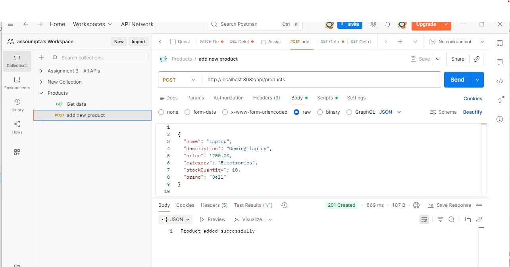
2. 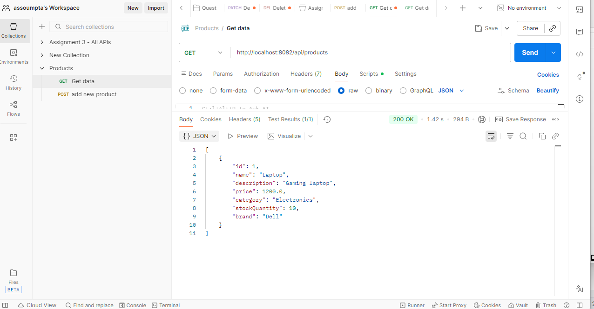
3. 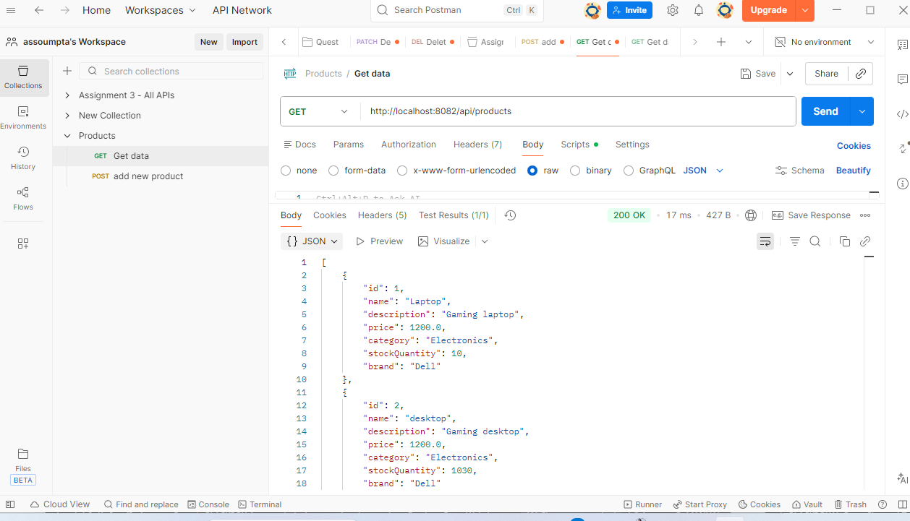
4. 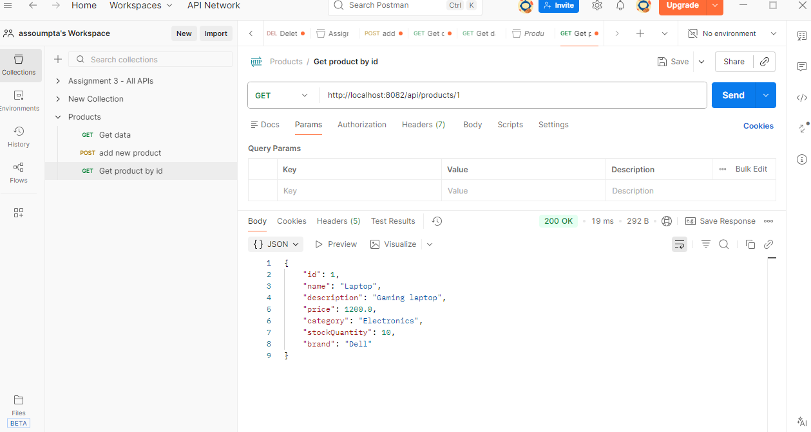
5. 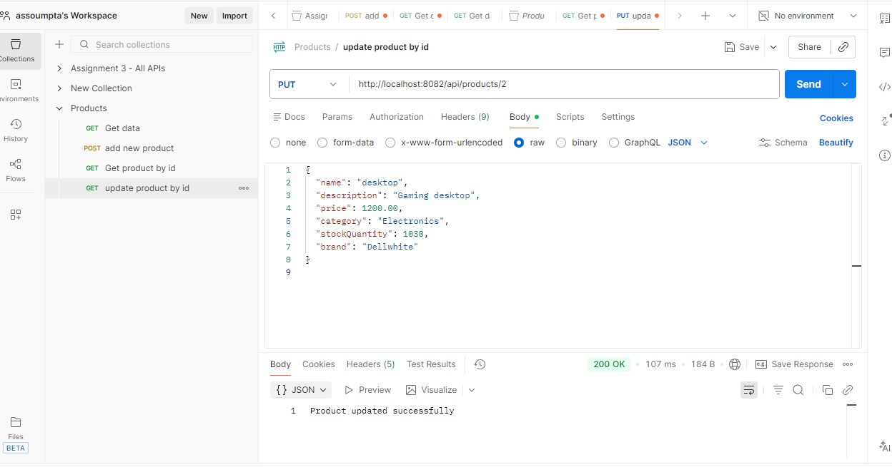
6. 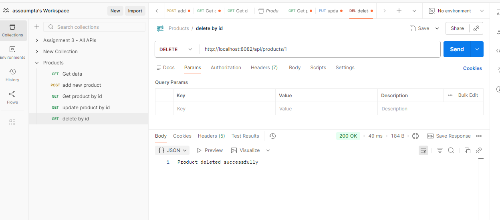
7. 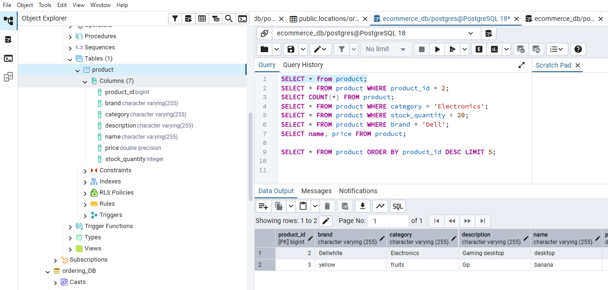
8. 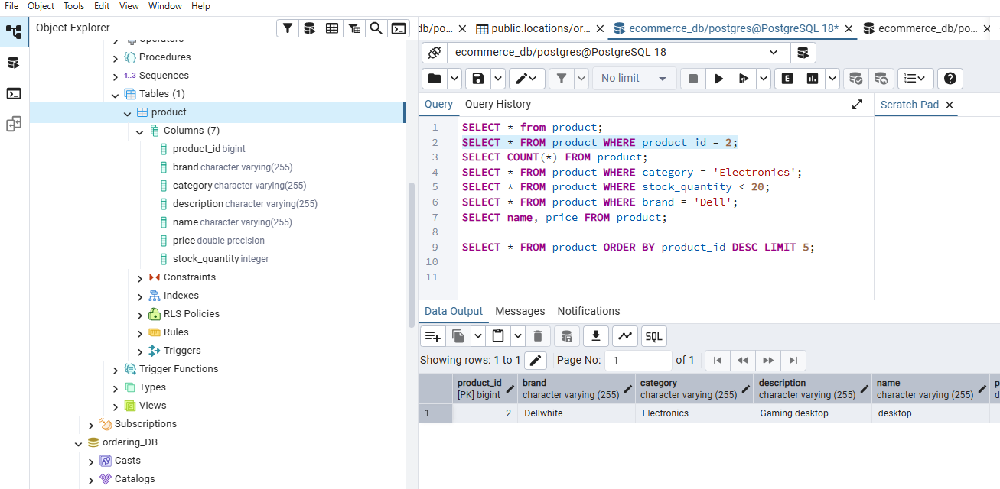
9. 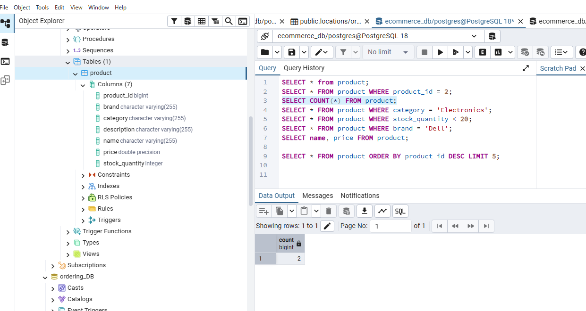
10. 
11. 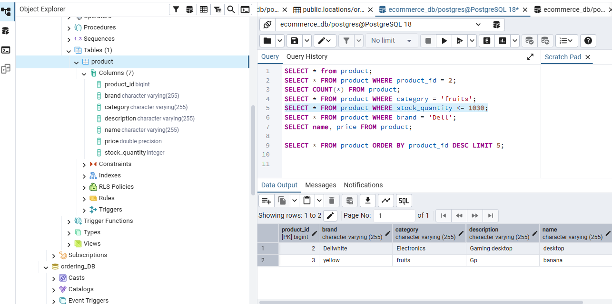
12. 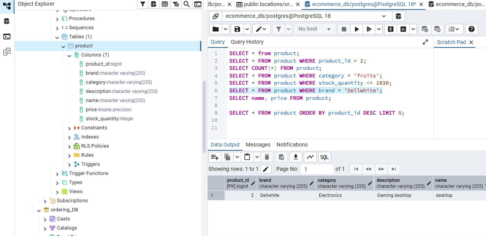
13. 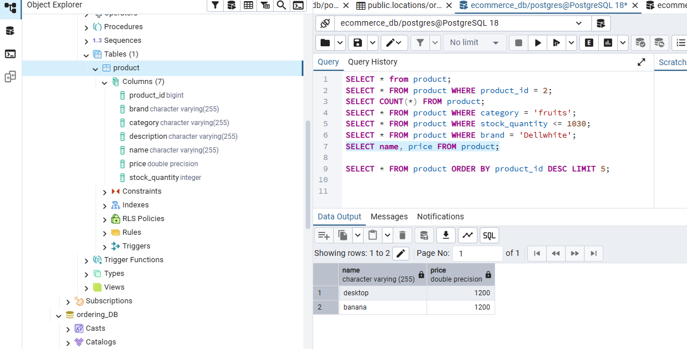
14. 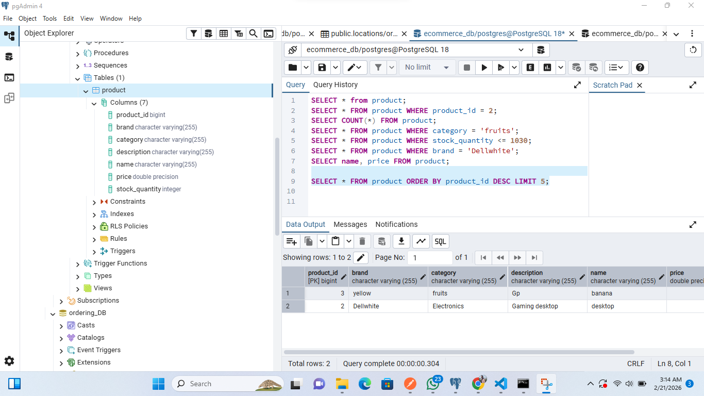

## Project Structure

```
restfullApiAssignment/
├── src/main/java/auca/ac/rw/restfullApiAssignment/
│   ├── controller/
│   │   └── ProductController.java
│   ├── modal/ecommerce/
│   │   └── Product.java
│   ├── repository/
│   │   └── ProductRepository.java
│   ├── service/
│   │   └── ProductService.java
│   └── RestfullApiAssignmentApplication.java
├── src/main/resources/
│   └── application.properties
└── pom.xml
```

## Author

AUCA - Advanced University of Central Africa
